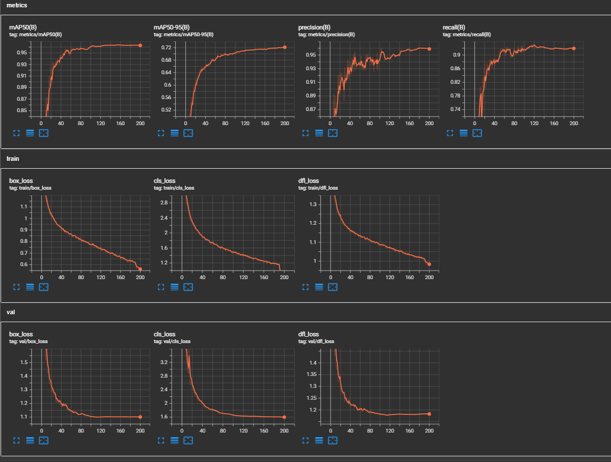
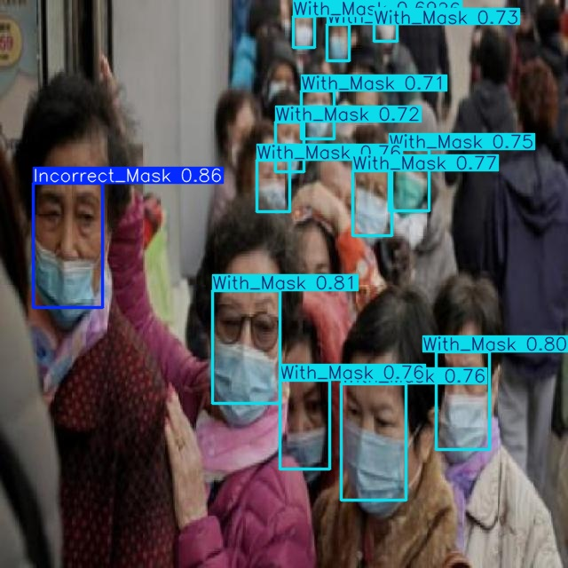
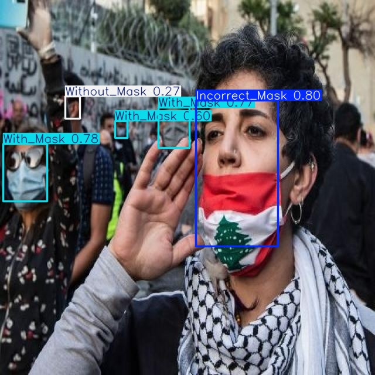

# Face Mask Detection
Manual mask monitoring in public areas (malls, hospitals, factories, schools) is inefficient and error-prone. It depends heavily on human attention, struggles in high-traffic environments, and lacks automated reporting.

This project builds a real-time, automated face mask detection system to reduce manual workload and improve monitoring efficiency.

---

## Project Overview
This project presents a lightweight, real-time face mask detection system built on the YOLOv8m model. The system is designed to automatically detect and classify mask-wearing status from live video streams with the highest possible efficiency and accuracy.
- With Mask — Mask worn correctly
- Without Mask — No mask detected
- Mask Worn Incorrectly — Mask not covering nose/mouth properly 

Features:
- Real-time video inference
- Bounding boxes + confidence scores
- Category-based counting

---

## Real-Time Demo (.pt – PyTorch)
Runs on a standard laptop webcam using the original .pt model.

---

## Dataset
**Source:** Face Mask Detection-2 (Roboflow)  
- Total images: 4,976  
- Categories: `With_Mask`, `Without_Mask`, `Incorrect_Mask`  
- Split: 3,790 Train | 732 Val | 454 Test  

### Class Imbalance
Original label distribution:

- With_Mask: 4,311  
- Without_Mask: 2,225  
- Incorrect_Mask: 867  

The `Incorrect_Mask` class was significantly underrepresented, which could bias the model toward majority classes.

### Data Balancing Approach
To address this:

- Performed oversampling by duplicating all `Incorrect_Mask` images and labels with new filenames.
- Used YOLO built-in augmentation
- Increased rotation range (`degrees = 20`) to improve robustness to face angles.

After balancing:

- Incorrect_Mask increased to 5,725 samples

Improved minority-class stability without removing majority data.

---

## Training Performance
The following metrics were recorded during training and evaluated on the validation set:

- **mAP@0.5:** **0.954**  
- **mAP@0.75:** **0.70**  
- **mAP@0.5:0.95:** **0.62**  
- **Precision (avg):** **0.959**  
- **Recall (avg):** **0.920**

### Inference Performance
- **`.pt` (PyTorch): ~20 FPS**

---

## Model Export and Deployment
The trained model was exported for cross-platform deployment:

- ONNX format for interoperability.
- TensorRT engine for optimized GPU inference.

### Benchmark (Personal Laptop)
**Hardware**
- CPU: Ryzen 7 5800H  
- GPU: NVIDIA RTX 3050 Laptop GPU  

**Model Accuracy (Validation Set)**
- **mAP@0.5:** **0.954**  
- **mAP@0.75:** **0.70**  
- **mAP@0.5:0.95:** **0.62**  
- **Precision (avg):** **0.94**  
- **Recall (avg):** **0.921**

**Inference Performance**
- **`.engine` (TensorRT, FP16): ~30 FPS**

The TensorRT model was exported with FP16 quantization to reduce computational cost while maintaining stable accuracy. In practical testing, the FP16 engine version delivered smoother and more stable real-time inference compared to the original `.pt` model.

### Real-Time Demo (.engine – TensorRT FP16)
Optimized deployment version running on webcam:

---

## Predict on Static Images
The predicted image will display the corresponding prediction results. Users just need to upload the image, and the model will classify the mask-wearing status of the person in the image (correct, incorrect, or no mask).

---

## 🔧 Installation & Setup
### Clone the Repository
    git clone https://github.com/danghohai2004/facemask-detector.git
    cd facemask-detector   
### Install Dependencies (Python 3.9.12)
    pip install -r requirements.txt
### Run Real-Time Detection
    python mask_detection.py

---

## 📜 License
This project is licensed under the MIT License. Feel free to use, modify, and distribute.

---

## 📬 Contact

- 📧 **Email** — [contact me](mailto:dhhaics2004@gmail.com?subject=Question%20about%20the%20Face%20Mask%20Detection%20Project)
- 🌐 **GitHub** — [@danghohai2004](https://github.com/danghohai2004)

---

# Thank you for your interest in this project!

